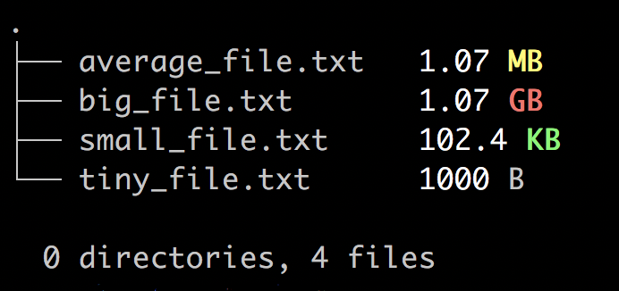

  
a simple enhancement to `ls` written in typescript

> pronounced `ls·info`

# features

- tree list
- size information (color-coded)
- directory/file differentiation (color-coded)
- total directory/files counter

# color-coded sizes

support for most common file sizes (`B`, `KB`, `MB`, and `GB`)  

